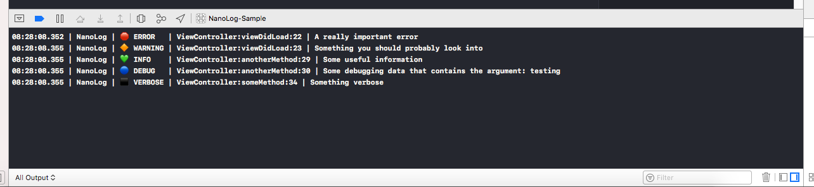

# NanoLog

[](https://travis-ci.org/andrewlord1990/nanolog-swift)
[](https://github.com/Carthage/Carthage)
[](https://cocoapods.org/pods/NanoLog)
[](https://github.com/apple/swift-package-manager)
[](https://github.com/andrewlord1990/nanolog-swift/blob/master/LICENSE)

A **powerful** and **extensible** logging framework for Swift that is **small** and **easy** to use!



***

## Key Benefits

#### ▶︎ Easy-to-use

You can be up and running with 1 line and then logging right away. Log statements are just as simple as using `print`.

#### ▶︎ Lightweight

The framework contains a small set of powerful features, so you don't need to include a large amount of code you won't use into your project to use NanoLog.

#### ▶︎ Extensible

The framework makes use of protocols for each layer in the logging process. This allows you to customise behaviour to your needs if you wish to. It comes bundled with the default console logging implementation.

#### ▶︎ Severity levels

Log messages at different severity levels, allowing to you see this in the console, but also deal with the levels differently if you want to. For example, only errors could be reported to your server in the production app. See [LogSeverity](Sources/Severity/LogSeverity.swift).

#### ▶︎ Coloured output

Each severity level has a coloured emoji icon, allowing you to attach colour to the log messages in the Xcode console. These icons can be changed to your liking if you don't want to use the default ones. See [LogSeverity](Sources/Severity/LogSeverity.swift).

#### ▶︎ Context of log call

The file, function (with arguments) and line number of the log call are included in the log output. This gives you context of where the logging is coming from. See [PrettyLogFormat](Sources/Format/PrettyLogFormat.swift).

#### ▶︎ Customisable log format

The log format is completely customisable, beyond the default implementation included. You can build up your preferred format from a set of different components, such as date/time, file/method/line, tag, message. See [PrettyLogFormat](Sources/Format/PrettyLogFormat.swift).

#### ▶︎ Fully documented

The public API is fully documented, including code documentation and ability to generate Jazzy docs.

## Platform Support

- Swift 4+
- Apple platforms:
  - iOS 8.0+
  - MacOS 10.10+
  - tvOS 9.0+
  - watchOS 2.0+

## Installation

### Dependency Managers

<details>
  <summary><strong>Carthage</strong></summary>
  <p>

You can use [Carthage](https://github.com/Carthage/Carthage) to integrate NanoLog into your Xcode project.

To do so, simply specify the dependency in your `Cartfile`:

```ogdl
github "andrewlord1990/NanoLog" == '0.0.1'
```

</p>
</details>

<details>
  <summary><strong>CocoaPods</strong></summary>
  <p>

You can use [CocoaPods](http://cocoapods.org) to integrate NanoLog into your Xcode project.

To do so, simply specify the dependency in your `Podfile`:

```ruby
pod 'NanoLog', '0.0.1'
```

</p>
</details>

<details>
  <summary><strong>Swift Package Manager</strong></summary>
  <p>

You can use [Swift Package Manager](https://swift.org/package-manager/) to integrate NanoLog into your project.

To do so, simply specify the dependency in your `Package.swift`:

```swift
.package(url: "https://github.com/andrewlord1990/nanolog-swift.git", .exact("0.0.1"))
```

</p>
</details>

### Manually

If you prefer not to use any of the dependency managers, you can integrate NanoLog manually.

<details>
  <summary><strong>Embedded Framework</strong></summary>
  <p>

- Download the latest release from [Releases](https://github.com/andrewlord1990/nanolog-swift/releases)
- Store the downloaded framework somewhere accessible
- Open your app project file in the Project Navigator
- Select your app target under the "Targets" heading in the sidebar
- Open the "General" tab
- Click on the `+` button under the "Embedded Binaries" section
- Add the downloaded `NanoLog.framework`

If you had already added another version of NanoLog, make sure to replace it with the new version.

  </p>
</details>

<details>
  <summary><strong>Git Submodules</strong></summary>
  <p>

- Open up Terminal, or your preferred console application
- `cd` to the top-level of your project directory
- If your project is not already a Git repository, run:

```bash
$ git init
```

- Add NanoLog as a Git [submodule](http://git-scm.com/docs/git-submodule) by running:

```bash
$ git submodule add https://github.com/andrewlord1990/nanolog-swift.git
$ git submodule update --init --recursive
```

- Open the `NanoLog` folder, and drag the `NanoLog.xcodeproj` into the Project Navigator of your Xcode project.
- Select the `NanoLog.xcodeproj` in the Project Navigator and verify the deployment target matches that of your application target.
- Next, open your app project file in the Project Navigator
- Select your app target under the "Targets" heading in the sidebar
- Open the "General" tab
- Click on the `+` button under the "Embedded Binaries" section
- You will see two different `NanoLog.xcodeproj` folders each with two different versions of the `NanoLog.framework` nested inside a `Products` folder.

    > It does not matter which `Products` folder you choose from.

- Select the `NanoLog.framework`.

> The `NanoLog.framework` is automatically added as a target dependency, linked framework and embedded framework in a copy files build phase which is all you need to build on the simulator and a device.

</p>
</details>

## Usage

NanoLog can be used primarily through a [static API](Sources/NanoLog.swift), however, if you would prefer, a [non-static API](Sources/Controller/NanoLogController.swift) is also available.

### Enable Logging

To setup logging, you will need to register a [`LoggingLane`](Sources/Lane/LoggingLane.swift). The easiest way to do this is using [`NanoLoggingLane`](Sources/Lane/NanoLoggingLane.swift).

Preferably, you will want to enable logging as early as possible in the app's lifecycle. This minimises any logging that will occur before logging has been enabled. This can be done in the `UIApplicationDelegate` initializer, or alternatively in the `application(_:willFinishLaunchingWithOptions:)` function.

**Using init**
```swift
import NanoLog
import UIKit

@UIApplicationMain
class AppDelegate: UIResponder, UIApplicationDelegate {

  init() {
    super.init()
    
    NanoLog.addDefaultConsoleLane()
  }
}
```

**Using application(_:willFinishLaunchingWithOptions:)**
```swift
import NanoLog
import UIKit

@UIApplicationMain
class AppDelegate: UIResponder, UIApplicationDelegate {
  
  func application(_ application: UIApplication,
                   willFinishLaunchingWithOptions launchOptions: 
                      [UIApplicationLaunchOptionsKey : Any]? = nil) -> Bool {

    NanoLog.addDefaultConsoleLane()
    return true
  }
}
```

This configuration will result in a logs being outputted to the Xcode console, using the default logging format.

### Perform Logging

For logging messages, there are methods available in [`NanoLog`](Sources/NanoLog.swift) that refer to the different severity levels. Each has a full-form and abbreviated form, depending on your preference, such as `NanoLog.e` and `NanoLog.error`.

```swift
func startLogging() {
  NanoLog.error("A really important error")
  NanoLog.w("Something you should probably look into")
  anotherMethod(withString: "testing")
  someMethod(withIntArg: 2)
}

func anotherMethod(withString string: String) {
  NanoLog.info("Some useful information")
  NanoLog.d("Some debugging data that contains the argument: \(string)")
}

func someMethod(withIntArg intArg: Int) {
  NanoLog.verbose("Something verbose")
}
```

## Advanced Usage

Beyond the default setup, you have the option of configuring whether particular messages are logged, where they are logged to and how they are logged.

### Console Logging Format

#### Using PrettyLogFormat

`PrettyLogFormat` allows you to use a customisable logging format, which drives how messages are formatted before being sent to the console. This is as simple as providing an array of `LogFormatComponent`.

```swift
let loggingFormat = PrettyLogFormat(withComponents: [
    .date(withDateFormat: "HH:mm:ss.SSS"),
    .separator(string: " | "),
    .severity(withFormat: .label),
    .separator(string: " | "),
    .file(withExtension: false),
    .separator(string: ":"),
    .lineNumber,
    .separator(string: " | "),
    .message
])

let lane = NanoLoggingLane(format: loggingFormat)

NanoLog.addLoggingLane(lane)
```

The example is how the default logging format is specified internally to the framework. There are other options available to you, have a look at [`LogFormatComponent`](Sources/Format/LogFormatComponent.swift) for details.

#### Using Own Implementation

You can also use your own implementation of the [`LogFormat`](Sources/Format/LogFormat.swift) protocol. It is as simple as implementing the `formattedMessage(from:withSeverity:withTag:forFile:forFunction:forLine)` function and returning a `String` for output.

```swift
class CustomLogFormat: LogFormat {
  public func formattedMessage(from message: @autoclosure () -> Any,
                               withSeverity severity: LogSeverity,
                               withTag tag: String,
                               forFile file: String,
                               forFunction function: String,
                               forLine line: Int) -> String {

      return "\(severity.label): \(message)"
    }
  }
  
let lane = NanoLoggingLane(format: CustomLogFormat())
NanoLog.addLoggingLane(lane)
```

I would suggest trying out `PrettyLogFormat` first, as it is easier to specify a list of components. Then, if what you want to do requires either extra components or something more complicated then consider your own `LogFormat` implementation.

### Adding extra LogSeverity

To add an extra `LogSeverity` you can simply create a `LogSeverity` instance and then use it via the NanoLog API.

```swift
let concernSeverity = LogSeverity(severity: 350, label: "CONCERN", icon: "⚪️")

NanoLog.message("A general concern", withSeverity: concernSeverity)
```

Using an extension to `LogSeverity` you can make you new severity more discoverable.

```swift
extension LogSeverity {
    static var concern: LogSeverity = {
        LogSeverity(severity: 350, label: "CONCERN", icon: "⚪️")
    }()
}

NanoLog.message("A general concern", withSeverity: .concern)
```

You can also add an extension to `NanoLog` to access it through a named function. This allows you to use it just like any of the built-in severity levels.

```swift
extension NanoLog {
    static func concern(_ message: @autoclosure () -> Any,
                        file: String = #file,
                        function: String = #function,
                        line: Int = #line) {
        NanoLog.message(message, withSeverity: .concern, file: file, function: function, line: line)
    }
}

NanoLog.concern("A general concern")
```

## Contributing

Issues and pull requests are welcome!

## Author

Andrew Lord [@andrewlord1990](https://twitter.com/@andrewlord1990)

## License

NanoLog is released under the Apache 2.0 license. See [LICENSE](https://github.com/andrewlord1990/nanolog-swift/blob/master/LICENSE) for details.
